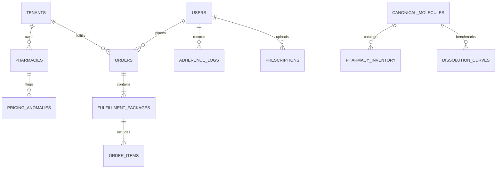

# GenericMed - Long-Term Project Memory & Knowledge Base

This document serves as the persistent system memory for the **GenericMed** platform. It documents the core domain architecture, existing features, schema specifications, business logic formulas, active limitations, and roadmap.

---

## 1. Project Overview

### 1.1 Mission & Vision
**GenericMed** is India's first unified clinical generic medicine discovery, CDSCO bioequivalence validation, multi-store smart dispensing, and regulatory governance platform.

In India, branded innovator medicines routinely sell for **5x to 10x the cost** of identical generic equivalents. While government initiatives like the **Pradhan Mantri Bhartiya Janaushadhi Pariyojana (PMBJP)** offer affordable medicines at 50–90% lower prices, adoption is held back by three core problems:
1. **Clinical Trust Deficit:** Lack of transparent, batch-level proof of pharmacological and dissolution equivalence.
2. **Fragmented Retail Distribution:** Jan Aushadhi Kendras frequently experience stock-outs on specific combinations, while private chemist chains lack incentives to promote low-margin unbranded generics.
3. **Regulatory Spoilage & Dumping:** Rogue digital distributors dumping substandard APIs, unverified batches, or near-expiry medicines below manufacturing costs.

### 1.2 Dual-Modality Architecture
GenericMed solves these challenges through a unified platform operating in two synchronized modalities:
- **Patient Mobile App (PWA):** An intuitive mobile interface for patients and caregivers to discover bioequivalent generics, calculate personal savings, configure chronic dose schedules, and split orders across private express pharmacies and government Jan Aushadhi stores.
- **Clinical Governance Console:** A high-density desktop control plane for CDSCO drug inspectors, registered pharmacists (R.Ph), and health administrators to audit Form 20/21 pharmacy licenses, monitor sub-floor pricing anomalies, inspect dissolution similarity factors ($f_2$), and review controlled prescription queues.

---

## 2. Tech Stack Summary

```
┌────────────────────────────────────────────────────────────────────────┐
│                        GENERICMED ARCHITECTURE                        │
├────────────────────────────────────────────────────────────────────────┤
│ Client Layer     : React 19, TypeScript 5.8, Vite 6, Tailwind CSS v4   │
│ Design Tokens    : Custom @theme tokens, Material Symbols, Inter, Mono │
│ Animations/Icons : Tailwind CSS v4 transitions, Material Symbols       │
│ Backend Runtime  : Express 4.21 (Planned Gateway), Node.js, dotenv     │
│ AI / Reasoning   : Google Gen AI SDK (@google/genai 2.4.0, Planned)    │
│ Target Database  : PostgreSQL 16 (RLS multi-tenancy) + Redis 7 (Plan)  │
│ Target Gateway   : Edge CDN + WAF + Nginx Ingress + JWT Auth (Plan)    │
│ Integrations     : ABHA / ABDM (UHI), UPI Auto-Pay, CDSCO Form Registry│
└────────────────────────────────────────────────────────────────────────┘
```

| Layer | Technologies & Libraries | Purpose |
| :--- | :--- | :--- |
| **Frontend Framework** | [React 19](https://react.dev/), [Vite 6](https://vitejs.dev/) | High-performance SPA with instant HMR and lean bundle output |
| **Type Safety** | [TypeScript 5.8](https://www.typescriptlang.org/) | Strict end-to-end typing across domain models and UI contracts |
| **Styling & Theme** | [Tailwind CSS v4](https://tailwindcss.com/) | Zero-runtime CSS variable design tokens defined in [index.css](file:///c:/Users/prana/Downloads/genericmed/src/index.css) |
| **Typography & Glyphs**| Inter, JetBrains Mono, Material Symbols | Medical-grade readability, unambiguous batch codes, and healthcare icons |
| **Micro-Animations** | Tailwind CSS v4 Utilities | CSS-based transitions, spinners, modal backdrops, and active adherence rings |
| **Backend Runtime** | Node.js, [Express 4.21](https://expressjs.com/), `tsx` | Planned modular monolith API gateway (Target Architecture - see Section 5) |
| **Clinical AI Engine**| [@google/genai 2.4.0](https://www.npmjs.com/package/@google/genai) | Planned multimodal Gemini 2.0 Flash for prescription handwriting OCR & NTI checks |
| **Persistence (Prod)**| PostgreSQL 16 with Row-Level Security (RLS) | Planned multi-tenant database isolation partitioned by `tenant_id` (see Section 6) |

---

## 3. Features Completed

| Module / Screen | File Path | Status | Capabilities Delivered |
| :--- | :--- | :--- | :--- |
| **Top Navigation Portal** | [TopNavigationPortalBar.tsx](file:///c:/Users/prana/Downloads/genericmed/src/components/common/TopNavigationPortalBar.tsx) | **Complete** | Global switcher between Patient App and Governance Console; smartphone frame toggle; active cart counter; user profile trigger. |
| **Search & Compare Screen** | [SearchCompareScreen.tsx](file:///c:/Users/prana/Downloads/genericmed/src/components/patient/SearchCompareScreen.tsx) | **Complete** | Generic vs branded innovator price comparison; hero savings calculator (86% savings); verified offer cards; CDSCO filter chips; real-time add to cart. |
| **Medicine Details Screen** | [MedicineDetailsScreen.tsx](file:///c:/Users/prana/Downloads/genericmed/src/components/patient/MedicineDetailsScreen.tsx) | **Complete** | In-depth chemical breakdown; molecular structure; excipients list; interactive dissolution curve comparison; verified pharmacy stock list. |
| **Clinical FAQ Accordion** | [MedicineDetailsScreen.tsx](file:///c:/Users/prana/Downloads/genericmed/src/components/patient/MedicineDetailsScreen.tsx) | **Complete** | Expandable clinical guide explaining bioequivalence parity (AUC 80-125%), NPPA generic pricing differential, and pharmacist substitution rights under NMC 2023 regulations. |
| **Multi-Store Cart & Split** | [CartCheckoutScreen.tsx](file:///c:/Users/prana/Downloads/genericmed/src/components/patient/CartCheckoutScreen.tsx) | **Complete** | Automatic basket partition into **Package 1 (Express 35-min)** and **Package 2 (Govt Kendra)**; strict bioequivalence substitution toggle; UPI Auto-Pay authorization. |
| **Patient Adherence Screen** | [PatientAdherenceScreen.tsx](file:///c:/Users/prana/Downloads/genericmed/src/components/patient/PatientAdherenceScreen.tsx) | **Complete** | 28-day adherence ring tracker (92% score); chronological dose schedule (Morning, Afternoon, Night); one-tap "Take Dose" logger; auto-refill triggers. |
| **Order Tracking Screen** | [OrderTrackingScreen.tsx](file:///c:/Users/prana/Downloads/genericmed/src/components/patient/OrderTrackingScreen.tsx) | **Complete** | Multi-package split order timeline; live delivery rider tracking; Jan Aushadhi pickup slot countdown; cold-chain temperature telemetry badge (4.2°C). |
| **Auth & Onboarding** | [AuthScreen.tsx](file:///c:/Users/prana/Downloads/genericmed/src/components/auth/AuthScreen.tsx) | **Complete** | Dual-method authentication (6-digit mobile OTP & password); 3-role registration (Patient, Pharmacist, Regulator); ABHA ID input; CDSCO drug inspector badge. |
| **User Profile Modal** | [UserProfileModal.tsx](file:///c:/Users/prana/Downloads/genericmed/src/components/auth/UserProfileModal.tsx) | **Complete** | User credentials viewer; quick role switcher between demo personas; LocalStorage session persistence; active order and prescription counters. |
| **Persona Switcher** | [UserProfileModal.tsx](file:///c:/Users/prana/Downloads/genericmed/src/components/auth/UserProfileModal.tsx) | **Complete** | One-tap persona switching between Rajesh Kumar (Patient), Suresh Patel (Pharmacist), and Dr. Ananya Sharma (CDSCO Regulator) with synchronized session persistence. |
| **Pharmacy Onboarding View** | [PharmacyOnboardingView.tsx](file:///c:/Users/prana/Downloads/genericmed/src/components/admin/PharmacyOnboardingView.tsx) | **Complete** | CDSCO Form 20/21 license review; Pharmacist registration match scoring; GPS geofence mismatch telemetry; provisional approval/rejection triggers. |
| **Document Viewer Modal** | [PharmacyOnboardingView.tsx](file:///c:/Users/prana/Downloads/genericmed/src/components/admin/PharmacyOnboardingView.tsx) | **Complete** | Full-screen modal inspection viewer for CDSCO Form 20/21 drug licenses and Pharmacist Registration Certificates with zoom and checklist items. |
| **Suspension Modal** | [PharmacyOnboardingView.tsx](file:///c:/Users/prana/Downloads/genericmed/src/components/admin/PharmacyOnboardingView.tsx) | **Complete** | Regulatory enforcement modal enabling state drug inspectors to apply custom clinical grounds and geofence penalties before provisional license suspension. |
| **Catalog & Equivalence** | [CatalogEquivalenceView.tsx](file:///c:/Users/prana/Downloads/genericmed/src/components/admin/CatalogEquivalenceView.tsx) | **Complete** | National CDSCO Master Index; in-vitro dissolution profiles; Moore-Flanner ($f_2$) score calculator; Narrow Therapeutic Index (NTI) safety guardrails. |
| **Pricing Anomaly Monitor** | [PricingAnomalyView.tsx](file:///c:/Users/prana/Downloads/genericmed/src/components/admin/PricingAnomalyView.tsx) | **Complete** | Sub-floor anti-dumping detector; near-expiry spoilage alerts; counterfeit batch flagging; Schedule H1/X duplicate reuse audit queue. |
| **Toast Notifications** | [ToastNotification.tsx](file:///c:/Users/prana/Downloads/genericmed/src/components/common/ToastNotification.tsx) | **Complete** | Lightweight clinical toast alert component auto-dismissing after 3 seconds. |
| **Admin Header & Sidebar** | [AdminHeader.tsx](file:///c:/Users/prana/Downloads/genericmed/src/components/admin/AdminHeader.tsx), [AdminSidebar.tsx](file:///c:/Users/prana/Downloads/genericmed/src/components/admin/AdminSidebar.tsx) | **Complete** | Collapsible desktop management shell with quick portal switches, active KPI ribbons, and role status badges. |

---

## 4. Pending Features

### Near-Term (Milestone 1)
- [ ] Connect frontend components to live Express REST/GraphQL endpoints.
- [ ] Implement OCR extraction pipeline for doctor prescriptions (Form 20/21 compliance) using `@google/genai`.
- [ ] Add real-time UPI payment webhooks (Razorpay / Cashfree test mode).
- [ ] Expand mock data to cover 50+ common Indian chronic molecules (Hypertension, Diabetes, Oncology).

### Mid-Term (Milestone 2)
- [ ] Live integration with National Medical Commission (NMC) doctor registration API.
- [ ] Direct synchronization with PMBJP Kendra warehouse stock APIs.
- [ ] GS1 DataMatrix 2D barcode scanner for physical batch verification at pharmacy counters.
- [ ] Automated WhatsApp adherence alerts via WhatsApp Business Cloud API.

### Long-Term (Milestone 3)
- [ ] Ayushman Bharat Digital Mission (ABDM) Universal Health Interface (UHI) protocol certification.
- [ ] Machine learning model for predictive anti-dumping anomaly detection based on regional chemical supply costs.
- [ ] Multi-lingual vernacular voice search (Hindi, Tamil, Telugu, Marathi, Bengali).

---

## 5. Target Backend Architecture (Specification Only) - API Endpoints Catalog

> [!IMPORTANT]
> **Planned Architecture (Specification Only) — Not Currently Implemented**
> The endpoints listed below describe the planned REST API specification for GenericMed's future Express backend. The application currently functions as a client-side Single Page Application (SPA) utilizing local React state and authentic pharmaceutical mock data from [mockData.ts](file:///c:/Users/prana/Downloads/genericmed/src/data/mockData.ts). No backend API server is currently active.

All endpoints follow RESTful conventions under `/api/v1/` with mandatory JWT Bearer authentication and `tenant_id` context headers.

### 5.1 Authentication & User Management
```http
POST   /api/v1/auth/otp/send            # Send 6-digit OTP to mobile
POST   /api/v1/auth/otp/verify          # Verify OTP & return JWT
POST   /api/v1/auth/login               # Password login for staff/regulators
POST   /api/v1/auth/register            # Register patient, pharmacist, or regulator
GET    /api/v1/users/me                 # Current authenticated profile
PATCH  /api/v1/users/me                 # Update contact or address details
```

### 5.2 Canonical Medicines & Bioequivalence Engine
```http
GET    /api/v1/molecules                # List canonical drug monographs (search, category, schedule)
GET    /api/v1/molecules/:id            # Detailed molecule record & innovator reference
GET    /api/v1/molecules/:id/dissolution # In-vitro dissolution curve points (t=5, 10, 15, 30, 45, 60 min)
POST   /api/v1/molecules/f2-calculate   # Compute Moore-Flanner f2 score between two dissolution curves
```

### 5.3 Search & Pharmacy Offers
```http
GET    /api/v1/search/medicines         # Semantic search (generic name, brand name, salt composition)
GET    /api/v1/search/offers            # Available pharmacy offers sorted by distance, price, or badge
GET    /api/v1/pharmacies/nearby        # Geofenced licensed pharmacies within radius
```

### 5.4 Cart & Smart Split Fulfillment
```http
POST   /api/v1/cart/validate            # Validate Rx requirements and stock availability
POST   /api/v1/cart/smart-split         # Partition cart items into Express and Govt Kendra packages
POST   /api/v1/orders/checkout          # Create multi-package order and initiate payment escrow
GET    /api/v1/orders/:id               # Real-time multi-package order status & rider coordinates
```

### 5.5 Compliance & Regulatory Governance
```http
GET    /api/v1/compliance/pharmacies    # List pending pharmacy applicants with risk scores
PATCH  /api/v1/compliance/pharmacies/:id # Approve, reject, or request physical inspection
GET    /api/v1/compliance/anomalies     # Active pricing anomalies below API floor
POST   /api/v1/compliance/anomalies/:id/lock # Lock listing from consumer search feed
GET    /api/v1/compliance/rx-queue      # Pending Schedule H1/X prescriptions for audit
PATCH  /api/v1/compliance/rx-queue/:id  # Audit approval / duplicate flag
```

### 5.6 Patient Adherence & Caregiver Reminders
```http
GET    /api/v1/adherence/schedule       # Today's dosage schedule (morning, afternoon, night)
POST   /api/v1/adherence/log-dose       # Mark dose as taken with timestamp
GET    /api/v1/adherence/streak         # 28-day compliance score and active streaks
POST   /api/v1/adherence/whatsapp-alert # Trigger manual or automated WhatsApp alert
```

---

## 6. Target Backend Architecture (Specification Only) - Database Schema Summary

> [!IMPORTANT]
> **Planned Architecture (Specification Only) — Not Currently Implemented**
> The relational schema, Entity-Relationship Diagram (ERD), and Row-Level Security (RLS) definitions below specify the target PostgreSQL data model planned for production deployment. The current client prototype does not connect to a live database; all records are seeded in [mockData.ts](file:///c:/Users/prana/Downloads/genericmed/src/data/mockData.ts).

The database architecture employs PostgreSQL with **Row-Level Security (RLS)** isolating each retail pharmacy tenant via `tenant_id`.



### Core Table Specifications:

#### `tenants`
- `id` (UUID, PK)
- `name` (VARCHAR)
- `type` (`RETAIL_CHAIN`, `JANAUSHADHI_HUB`, `HOSPITAL_PHARMACY`)
- `created_at` (TIMESTAMPTZ)

#### `users`
- `id` (UUID, PK)
- `name` (VARCHAR)
- `role` (`patient`, `pharmacist`, `regulator`)
- `phone` (VARCHAR, UNIQUE)
- `email` (VARCHAR)
- `abha_id` (VARCHAR, NULLABLE)
- `license_number` (VARCHAR, NULLABLE)
- `is_verified` (BOOLEAN)

#### `canonical_molecules`
- `id` (UUID, PK)
- `code` (VARCHAR, UNIQUE) - e.g. `MOLECULE-CARD-082`
- `atc_code` (VARCHAR) - e.g. `C10AA05`
- `name` (VARCHAR) - e.g. `Atorvastatin Calcium 20mg`
- `category` (VARCHAR)
- `schedule` (VARCHAR) - `Schedule H`, `Schedule H1`, `Schedule X`
- `f2_score` (NUMERIC)
- `is_valid_f2` (BOOLEAN)
- `innovator_reference` (VARCHAR) - e.g. `Lipitor 20mg`
- `innovator_price` (NUMERIC)
- `api_floor_price` (NUMERIC)

#### `dissolution_curves`
- `id` (UUID, PK)
- `molecule_id` (UUID, FK -> `canonical_molecules.id`)
- `formulation_type` (`INNOVATOR`, `GENERIC_TEST`)
- `batch_number` (VARCHAR)
- `time_minutes` (INTEGER) - 5, 10, 15, 30, 45, 60
- `percentage_dissolved` (NUMERIC)

#### `pharmacies`
- `id` (UUID, PK)
- `tenant_id` (UUID, FK -> `tenants.id`, INDEXED)
- `name` (VARCHAR)
- `gstin` (VARCHAR)
- `dl_number_form20` (VARCHAR)
- `dl_number_form21` (VARCHAR)
- `pharmacist_name` (VARCHAR)
- `pharmacist_pci_reg` (VARCHAR)
- `latitude` (NUMERIC)
- `longitude` (NUMERIC)
- `is_active` (BOOLEAN)

#### `fulfillment_packages`
- `id` (UUID, PK)
- `order_id` (UUID, FK -> `orders.id`)
- `pharmacy_id` (UUID, FK -> `pharmacies.id`)
- `type` (`express_private`, `govt_kendra`)
- `status` (`dispatched`, `in_transit`, `delivered`)
- `delivery_fee` (NUMERIC)
- `cold_chain_tracked` (BOOLEAN)

---

## 7. Important Business Logic & Clinical Algorithms

### 7.1 Moore-Flanner Bioequivalence Similarity Factor ($f_2$)
To confirm bioequivalence between test generic ($T$) and reference innovator ($R$) batches across $n$ sampling time points:

$$f_2 = 50 \cdot \log_{10} \left[ \left( 1 + \frac{1}{n} \sum_{t=1}^{n} (R_t - T_t)^2 \right)^{-0.5} \times 100 \right]$$

- **Threshold Criteria:**
  - $50 \le f_2 \le 100$: Approved for automatic substitution.
  - $f_2 < 50$: Flagged as non-equivalent; automatic substitution blocked.
  - At $t=15$ min, both formulations must achieve $\ge 85\%$ dissolution to qualify as rapidly dissolving.

### 7.2 Multi-Store Smart Split Logic
When a patient confirms a cart containing $N$ distinct items:
1. For each item $i$, query available inventory within the user's geofenced radius ($r \le 5\text{ km}$).
2. If item $i$ is stocked by a verified PMBJP Jan Aushadhi Kendra and the user's order schedule permits next-day delivery:
   - Assign item to **Package 2 (Govt Kendra Slot)**.
3. If item $i$ is cold-chain dependent, requires immediate delivery (<45 min), or is out-of-stock at Jan Aushadhi:
   - Assign item to **Package 1 (Express Private Pharmacy Slot)**.
4. Calculate separate delivery fees:
   - Package 1: Free if order $\ge ₹199$, else ₹30.
   - Package 2: Standard hub dispatch ₹15.

### 7.3 Sub-Floor Anti-Dumping & Counterfeit Check
For any pharmacy listing price $P_{\text{quoted}}$ of molecule $M$:
$$P_{\text{floor}} = \text{Cost}_{\text{API}} + \text{Cost}_{\text{Excipients}} + \text{Cost}_{\text{Packaging}} + \text{Excise}_{\text{Min}}$$
- If $P_{\text{quoted}} < 0.50 \times P_{\text{floor}}$:
  - Trigger **Compliance Lock** under rule `FR-CORE-02`.
  - Record anomaly in `pricing_anomalies` table.
  - Hide listing from patient search results pending human inspector sign-off.

---

## 8. Known Issues & Technical Constraints

1. **Client-Side Mock Layer:** Data state changes (e.g., approving a pharmacy applicant or locking a price anomaly) currently mutate in-memory React state and do not persist across hard browser refreshes, except for `currentUser` which is stored in `localStorage`.
2. **Prescription OCR Mock:** In the current demo build, prescription scanning simulates OCR recognition and signature matching; production requires integration with `@google/genai` (Gemini 2.0 Flash) on the Express backend.
3. **Chart Visualizations:** In-vitro dissolution curves in [CatalogEquivalenceView.tsx](file:///c:/Users/prana/Downloads/genericmed/src/components/admin/CatalogEquivalenceView.tsx) are rendered as responsive SVG vectors rather than heavy WebGL/Canvas charting libraries to keep client bundles lightweight.

---

## 9. Future Roadmap

```
2026 Q3 (Current)      2026 Q4               2027 Q1               2027 Q2
┌──────────────────┐  ┌──────────────────┐  ┌──────────────────┐  ┌──────────────────┐
│ Interactive MVP  │  │ Production Core  │  │ Live Integrations│  │ ABDM / UHI Scale │
│ Dual Modality UI │  │ Node.js/Express  │  │ PMBJP Live Sync  │  │ UHI Gateway Cert │
│ Algorithmic Spec │─>│ PostgreSQL + RLS │─>│ OCR Rx Parser    │─>│ AI Voice Search  │
│ 12 System Modules│  │ Cloud Run Deploy │  │ WhatsApp Adhere  │  │ Pan-India CRO Hub│
└──────────────────┘  └──────────────────┘  └──────────────────┘  └──────────────────┘
```
